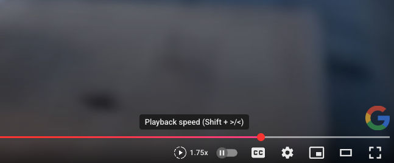

# YouTube Playback Speed Controls

A Chrome extension that adds a custom speed control button directly to YouTube's video player toolbar, providing quick access to playback speed options.

## Features

- **Direct Speed Control**: Adds a speed button to YouTube's video player toolbar
- **Native Look**: Matches YouTube's design and integrates seamlessly
- **Quick Access**: No need to go through settings menu - speed control is always visible
- **All Speed Options**: Supports 0.25x, 0.5x, 0.75x, Normal, 1.25x, 1.5x, 1.75x, and 2x
- **Real-time Updates**: Button shows current playback speed
- **Works Everywhere**: Compatible with all YouTube video pages (not Shorts)

## Installation

1. Download or clone this repository
2. Open Chrome and go to `chrome://extensions/`
3. Enable "Developer mode" (toggle in top right)
4. Click "Load unpacked" and select the extension folder
5. The extension will automatically activate on YouTube

## Usage

1. Navigate to any YouTube video
2. Look for the speed control button in the video player toolbar (right side)
3. Click the button to open the speed menu
4. Select your desired playback speed
5. The button will show the current speed (e.g., "1.5x")

## Files

- `manifest.json` - Extension configuration
- `content_script.js` - Main functionality
- `styles.css` - Button styling
- `icons/` - Extension icons

## Compatibility

- Chrome/Chromium browsers
- YouTube video pages (not Shorts or embedded players)
- Manifest V3

## License

This project is open source and available under the MIT License.